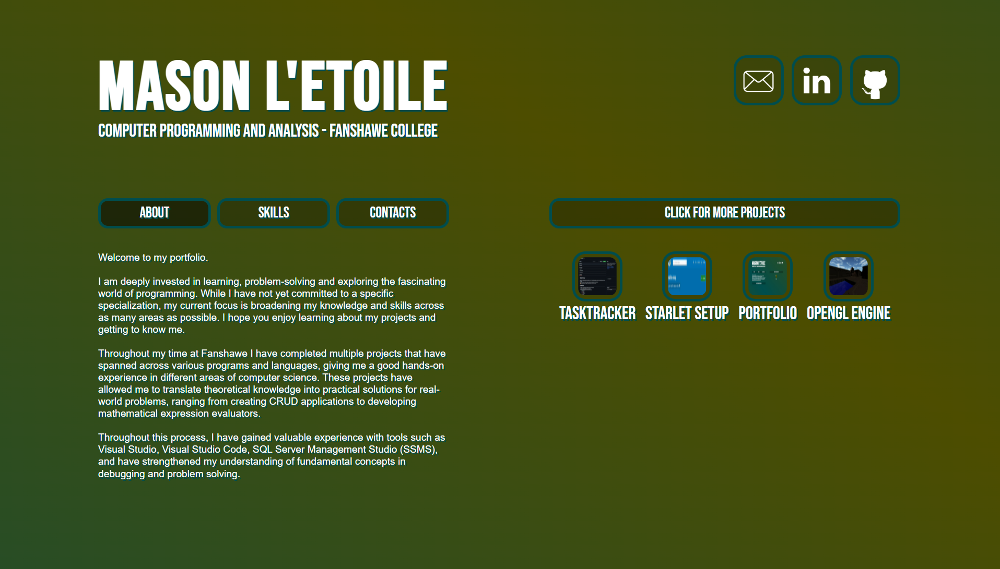

# Portfolio
Personal development portfolio showcasing my projects, skills, and contact information in a responsive and minimal design.




## Features
- Responsive design with HTML, CSS, and JavaScript.
- Contact form using Resend API.
- Project showcase with image previews, tech stacks, and GitHub links.
- Typewriter-style introduction

## 🔗 **Website**: 
- [**masonletoile.ca**](https://masonletoile.ca)
- [**masonletoile.com**](https://masonletoile.com)

## Tech Stack
<p align="left">
  
  
  
  
  
  
  
</p>


<br/>


## Deployment & Configuration
### Prerequisites
- npm
- Node.js 18+ (for local development and building only)
- Resend API key (optional, for email form on contact page)

### 1. Clone the Repository
```bash
# Clone Portfolio
git clone https://github.com/masonlet/portfolio.git
cd portfolio

# Install and start
npm install
```

### **Resend**
If you wish to use the contact form with resend you must create `.env` file from `.env.example` and add your Resend API key before starting your server.

### Run Locally
```bash
# Start development server
npm run dev
```

#### Open https://localhost:5173 (or the address shown in your terminal) in your browser.

### Build for Production
```bash
# Build 
npm run build

# Preview production output locally
npm run preview
```

#### Open https://localhost:4173 (or the address shown in your terminal) in your browser.

### Deployment
The production build outputs static files to the `dist/` directory which can be hosted on any static hosting provider. Node.js is **not required** to run the deployed site.


<br/>


## License
MIT License - see [LICENSE](./LICENSE) for details.
